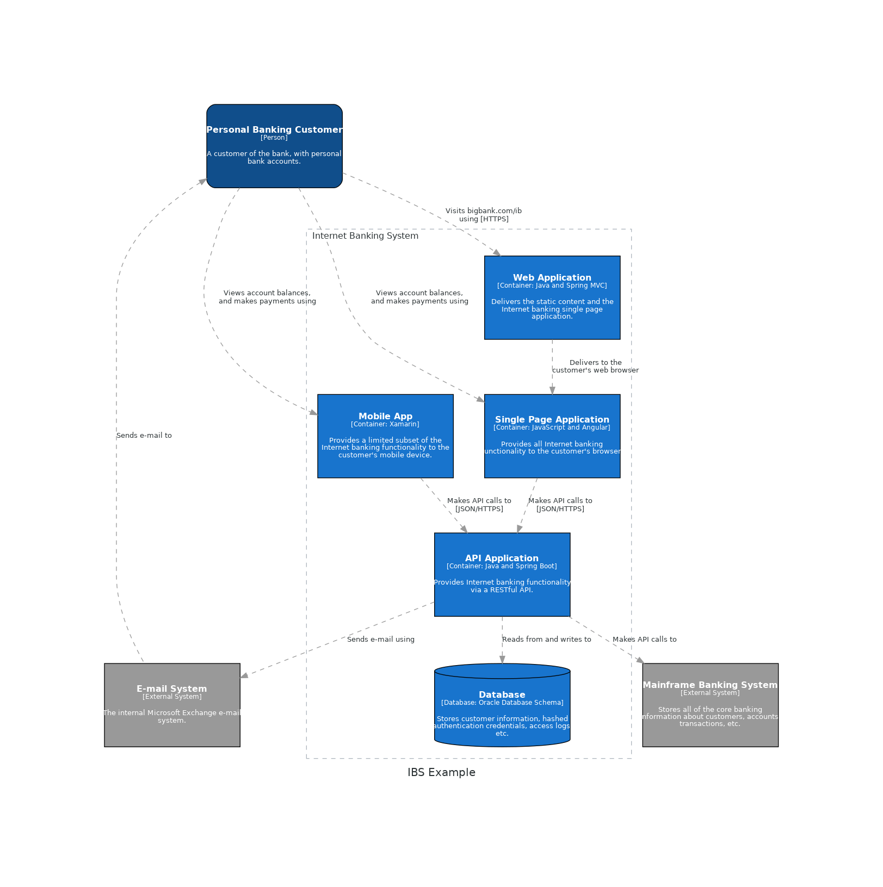

# Requirements
 - Python >= 3.6


# Getting started


Install [Graphviz](https://www.graphviz.org/) for visual rendering (**Ubuntu**).
```console
sudo apt install graphviz
```

Create virtual environment
```console
python3.10 -m venv "venv" && source venv/bin/activate
```

Install [Diagrams](https://diagrams.mingrammer.com/docs/getting-started/installation)
```console
pip install diagrams
```


# Example

Internet Banking System Diagram




